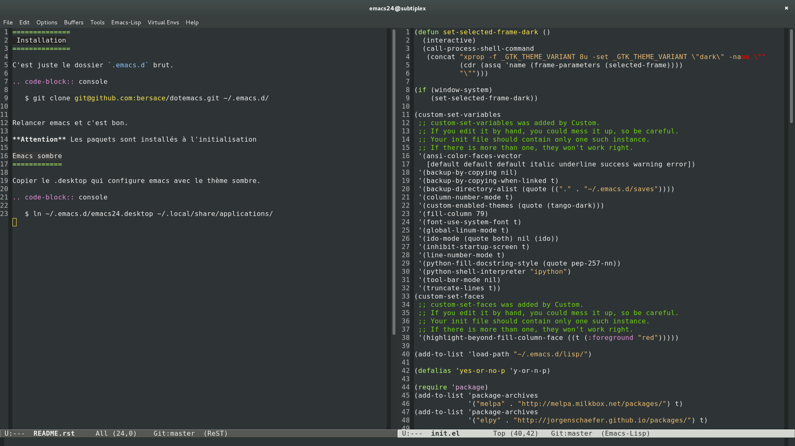

==============
 Installation
==============

C'est juste le dossier `.emacs.d` brut. Installer emacs24,
emacs-goodies-el.

.. code-block:: console

   $ git clone https://github.com/bersace/dotemacs.git ~/.emacs.d/

Relancer emacs et c'est bon.

**Attention** Les paquets sont installés à l'initialisation

Emacs sombre
============

Copier le .desktop qui configure emacs avec le thème sombre.

.. code-block:: console

   $ ln ~/.emacs.d/emacs24.desktop ~/.local/share/applications/

Capture d'écran
===============

